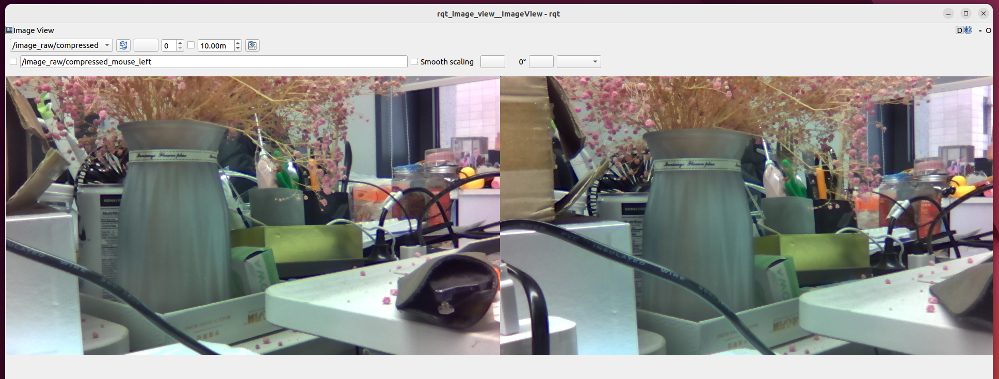
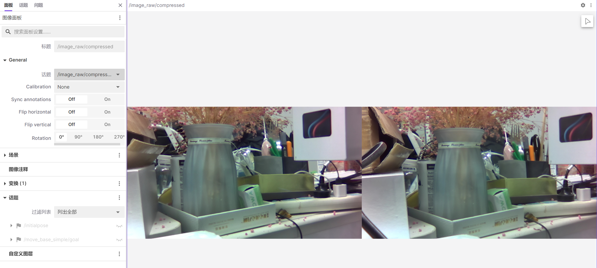

English| [简体中文](./README_cn.md)

# Feature Introduction

Configure the dual MIPI interface binocular camera that has been adapted, save the collected image data locally, and publish it in ROS standard image messages for other modules that need to use image data to subscribe.

# Bill of Materials

Currently supported MIPI cameras are as follows

| Number | Name   | Sample Image                 | Parameters | Reference Link                                                |
| ---- | ------ | --------------------------- | -------- | ------------------------------------------------------------ |
| 1    | IMX219 |  | 800W Pixels | [IMX219](https://www.waveshare.net/shop/IMX219-83-Stereo-Camera.htm) |


# Usage

## Hardware Connection

The connection method of IMX219 binocular camera with RDK X3 Module is as shown in the figure below:

  

The mipi lines of the two cameras are connected to any two slots of CAM0/CAM1/CAM2 on the carrier board.

The serial line is connected to the 40-pin slot on the carrier board, with the yellow line plugged into the SDA slot and the deep blue line plugged into the SCL slot.

## Compilation

After downloading the source code, run the following command in the terminal of the RDK system to compile:

```shell
source /opt/tros/setup.bash
colcon build
```

## Start the Camera

Run the following command in the terminal of the RDK system to use the default camera configuration:

```bash
# Configure the tros.b environment:
source /opt/tros/setup.bash
source install/local_setup.bash
# Start in launch mode
ros2 launch hobot_stereo_mipi_cam imx219_stereo.launch.py
```

After successful startup, the terminal will output logs like below:

```bash
[hobot_stereo_mipi_cam-1] 2024/02/02 14:28:03.063 !INFO [x3_cam_init_param][0099]Enable mipi host0 mclk
[hobot_stereo_mipi_cam-1] 2024/02/02 14:28:03.063 !INFO [x3_cam_init_param][0099]Enable mipi host1 mclk
[hobot_stereo_mipi_cam-1] [WARN] [1706855283.264779644] [MipiStereoCap]: video_index: 2 sp_open_camera_v2 success
[hobot_stereo_mipi_cam-1] [WARN] [1706855283.265198332] [mipi_stereo_cam_node]: Init success!
[hobot_stereo_mipi_cam-1] [INFO] [1706855284.318240924] [mipi_stereo_cam_node]: Got image fps 31.47
[hobot_stereo_mipi_cam-1] [INFO] [1706855285.338565631] [mipi_stereo_cam_node]: Got image fps 30.39
[hobot_stereo_mipi_cam-1] [INFO] [1706855286.359621260] [mipi_stereo_cam_node]: Got image fps 30.39
[hobot_stereo_mipi_cam-1] [INFO] [1706855287.379004307] [mipi_stereo_cam_node]: Got image fps 30.42
[hobot_stereo_mipi_cam-1] [INFO] [1706855288.399128858] [mipi_stereo_cam_node]: Got image fps 30.42
[hobot_stereo_mipi_cam-1] [INFO] [1706855289.419326072] [mipi_stereo_cam_node]: Got image fps 30.39
```

stereo_mipi_cam.launch.py configures the default output of left and right view stitched 3840x1080 resolution jpeg image, published topic name is /image_raw/compressed.

## Image Visualization

### Using ROS rqt_image_view

Here we use the rqt_image_view to visualize the image, make sure to have ROS2 Foxy or Humble version installed on the PC.

Ensure that the PC and RDK X3 are on the same network segment. For Foxy version, execute the following on the PC:

```shell
# Set up ROS2 environment
source /opt/ros/foxy/local_setup.bash
ros2 run rqt_image_view rqt_image_view
```

Select topic /image_raw/compressed, the image effect is as shown below:




### Using foxglove for Visualization

Here we use [foxglove](https://foxglove.dev/studio) for image visualization, rosbridge-suite needs to be installed on RDK.

Installation command:

```bash
apt install ros-foxy-rosbridge-suite
```

Launch command:

```bash
# Set up for tros.b environment:
source /opt/tros/setup.bash
ros2 launch rosbridge_server rosbridge_websocket_launch.xml
```
After starting foxglove, open the image panel and select the topic `/image_raw/compressed`, the image effect is as follows:



## Data Collection

Supports automatic collection of image data and saves the collected image data locally.

Images are saved in the path `cam_[index]` under the running path, where index is the camera number. For example, if two mipi lines are connected to the CAM0 and CAM2 slots on the carrier board, the save paths will be `cam_0` and `cam_2` respectively.

Run the following command in the terminal of the RDK system to start data collection, using the `data_sampling_ms_diff` parameter to set the interval for collecting a set of data every 30ms:

```bash
# Configure the tros.b environment:
source /opt/tros/setup.bash
source install/local_setup.bash
# Start via launch method
ros2 launch hobot_stereo_mipi_cam imx219_stereo.launch.py data_sampling_ms_diff:=30
```

Upon successful start, the terminal will output as follows:

```shell
[hobot_stereo_mipi_cam-1] 2024/02/02 14:29:13.174 !INFO [x3_cam_init_param][0099]Enable mipi host0 mclk
[hobot_stereo_mipi_cam-1] 2024/02/02 14:29:13.174 !INFO [x3_cam_init_param][0099]Enable mipi host1 mclk
[hobot_stereo_mipi_cam-1] [WARN] [1706855353.361908545] [MipiStereoCap]: video_index: 2 sp_open_camera_v2 success
[hobot_stereo_mipi_cam-1] [WARN] [1706855353.362105243] [mipi_stereo_cam_node]: Data collecting is enabled
[hobot_stereo_mipi_cam-1] [WARN] [1706855353.362587677] [mipi_stereo_cam_node]: Init success!
[hobot_stereo_mipi_cam-1] [WARN] [1706855353.902281515] [mipi_stereo_cam_node]: collecting img file: ./cam_0/0000001.jpg
[hobot_stereo_mipi_cam-1] [WARN] [1706855354.114726633] [mipi_stereo_cam_node]: collecting img file: ./cam_2/0000001.jpg
[hobot_stereo_mipi_cam-1] [INFO] [1706855354.416454771] [mipi_stereo_cam_node]: Got image fps 31.43
[hobot_stereo_mipi_cam-1] [WARN] [1706855354.695745587] [mipi_stereo_cam_node]: collecting img file: ./cam_0/0000002.jpg
[hobot_stereo_mipi_cam-1] [WARN] [1706855354.914084197] [mipi_stereo_cam_node]: collecting img file: ./cam_2/0000002.jpg
[hobot_stereo_mipi_cam-1] [INFO] [1706855355.435655203] [mipi_stereo_cam_node]: Got image fps 30.45
[hobot_stereo_mipi_cam-1] [WARN] [1706855355.513600173] [mipi_stereo_cam_node]: collecting img file: ./cam_0/0000003.jpg
[hobot_stereo_mipi_cam-1] [WARN] [1706855355.725688892] [mipi_stereo_cam_node]: collecting img file: ./cam_2/0000003.jpg
```

View the collected images under the startup path:

```bash
# ls cam_*
cam_0:
0000001.jpg  0000002.jpg  0000003.jpg  0000004.jpg  0000005.jpg

cam_2:
0000001.jpg  0000002.jpg  0000003.jpg  0000004.jpg  0000005.jpg
```

# Interface Description## Topics

### Publish Topics

| Name              | Message Type                          | Description                               |
| ----------------- | ------------------------------------- | ----------------------------------------- |
| /image_raw/compressed | sensor_msgs::msg::CompressedImage   | Periodically publishes image topics in JPEG format |

## Parameters

| Name                    | Parameter Value         | Description                                       |
| ----------------------- | ----------------------- | ------------------------------------------------- |
| image_width             | 1920 (default)         | Related to the camera used                         |
| image_height            | 1080 (default)         | Related to the camera used                         |
| data_sampling_ms_diff   | -1 (default)           | Time interval for collecting image data, in ms. <=0 means not collecting data, >0 means collecting a group of image data every data_sampling_ms_diff ms |

# FAQs

1. How to set the video_device parameter for the camera?

   The video_device parameter corresponds to different slots on the carrier board where the camera is connected. Set the video_device parameter in `include/mipi_stereo_cam_node.h` file under the `std::vector<int> video_index_ {0, 2}` configuration. By default, it is connected to slots CAM0 and CAM2.

2. How to use the stereo data published by the camera?

   The data captured by the camera is left and right views of nv12 format images with timestamp alignment. In the `void OnRecvedImg(std::vector<std::shared_ptr<MipiStereoCamImg>> imgs)` interface, first encode the two image data into JPEG format. If data sampling is enabled, save these two image data locally, then concatenate and publish the two JPEG images horizontally.

   Please note that the process of concatenating and publishing the left and right view JPEG images is time-consuming. If using image data for algorithm perception, it is recommended to only perform algorithm inference on the nv12 format image data, without concatenating and publishing JPEG format images.
